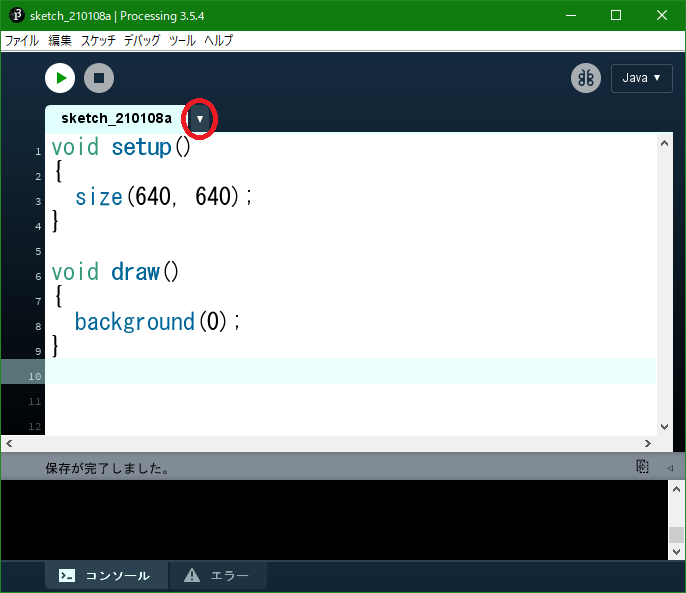
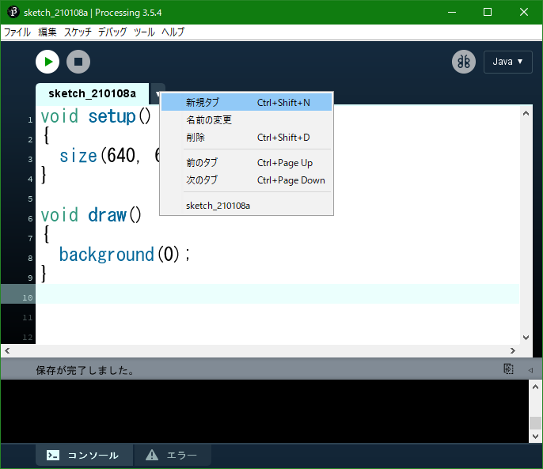
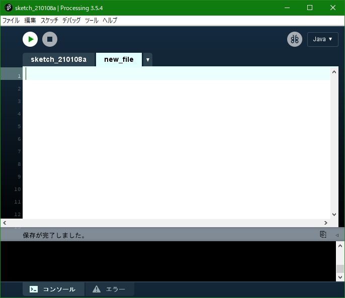

# Processingで知りたいこと・しておきたい設定

## タブ

今開いているファイルの横に下三角のマーク▼がある
それを押すと，「新規タブ」というものがある．
押し，新しく作るタブ（ファイル）の名前を書くと，新しくタブ（ファイル）を作ることができる．

タブでは，1つのタブ（ファイル）で書いているのと同じように書くことができる．

これにより，1つ1つ見やすくすることができる．

- 赤丸の部分をクリック

- 新規タブをクリック

- 入力フォームで入れた名前のタブが作られる．

## コード補完

「ファイル」 → 「設定」 → 「コード補完 Ctrl-space」 にチェックを入れる．

1. 関数名や変数名などを途中まで入力する．

2. 「コントロール」+「スペース」で，候補の一覧が表示される．

3. 「上下キー」で選択を移動し，「エンター」を押すと挿入される．

## コメント化，コメント解除

1. コメント/コメント解除したい行にカーソルを置く，もしくは選択する．

2. 「コントロール」+「/」で，コメント化/コメント解除を素早く行える

## フォーマット

1. 「コントロール」+「t」で自動でフォーマットできる．
